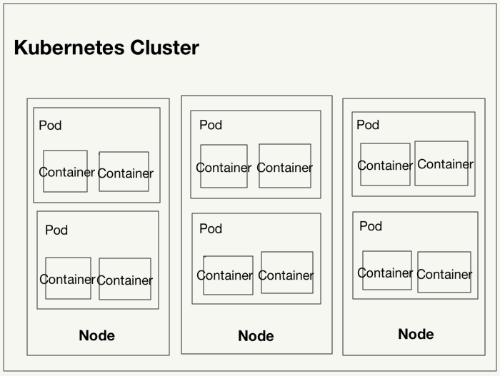
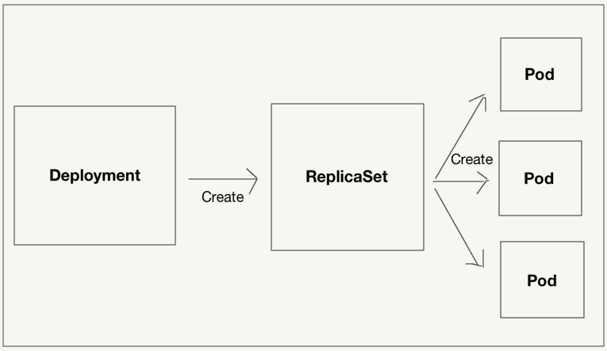

# Kubernetes
Kubernetesの基礎知識やコマンドをメモしていく.

# Kubernetesとは
Kubernetesは、コンテナの運用を自動化するためのコンテナオーケストレーションシステム.

# 環境構築

## Kubernetesの有効化
DockerのPreferenceから有効にする.

## kubectlのインストール
kubectlは、Kubernetesを操作するためのコマンドラインツール.

```
curl -LO https://storage.googleapis.com/kubernetes-release/release/v1.10.4/bin/darwin/amd64/kubectl && chmod +x kubectl && mv kubectl /usr/local/bin/
```

## ダッシュボードのインストール
ダッシュボードは、Kubernetesにデプロイされているコンテナ等を確認できるWebベースの管理ツール.

```
kubectl apply -f https://raw.githubusercontent.com/kubernetes/dashboard/v1.8.3/src/deploy/recommended/kubernetes-dashboard.yaml
```

STATUS=RunningになていればOK.

```
kubectl get pod --namespace=kube-system -l k8s-app=kubernetes-dashboard
```

ダッシュボードをブラウザで閲覧するために、ダッシュボードへのプロキシサーバを立ち上げる.

```
kubectl proxy
```

次のURLにアクセスできればOK.

```
http://localhost:8001/api/v1/namespaces/kube-system/services/https:kubernetes-dashboard:/proxy/
```

## Kubernetesの概念
### KubernetesクラスタとNode
Kubernetesクラスタは、Kubernetesの様々なリソースを管理する集合体のこと. クラスタが持つリソースで最も大きな概念がNode (ノード).
NodeはKubernetesのクラスタの管理下に登録されているDockerホストのことで、Kubernetesでコンテナをデプロイするために利用される.

クラスタに参加しているNodeの一覧を取得

```
kubectl get nodes
```

### Namespace
Namespaceの利用は一定の規模を有するチーム開発で有用. 例えば、開発者それぞれのNamespaceを用意することでメインのNamespaceが散らかるのを防げる.
クラスタを構築するとデフォルトで、default, docker, kube-public, kube-systemというNamespaceが用意されている.

### Pod
Podは、コンテナの集合体の単位で、少なくとも1つのコンテナを持つ. KubernetesをDockerと組み合わせる場合、Podが持つのはDockerコンテナ単体あるいはDockerコンテナの集合体.



#### マニフェストファイル
Kubernetesの各種リソースを定義するyamlファイルをマニフェストファイルと呼ぶ. マニフェストファイルの内容をそのままKubernetesクラスタに反映させるには、次のように行う.

```
ex) kubectl apply -f simple-pod.yaml
```

オプション
- --record: 実行したコマンドを記録する

#### kubectl rollout history - リビジョンの確認

```
ex) kubectl rollout history deployment echo
```

- --revision: 特定のリビジョンの内容を確認する

#### kubectl rollout undo - ロールバック

```
ex) kubectl rollout undo deployment echo
```

#### kubectl get pod - Podの一覧

```
ex) kubetctl get pod
```

#### kubectl exec - コンテナの中に入る

```
ex) kubectl exec -it simple-echo sh -c nginx
```

#### kubectl logs - ログの出力

```
ex) kubectl logs -f simple-echo -c echo
```

#### kubectl delete pod - Podの削除

```
ex) kubectl delete pod simple-echo
```

```
ex) kubectl delete pod simple-pod.yaml
```

### ReplicaSet
ReplicaSetは、同じ仕様のPodを複数生成・管理するためのリソース.

### Deployment
Deploymentは、ReplicaSetを管理・操作するためのリソース. アプリケーションデプロイの基本単位となる.  
Pod, ReplicaSet, Deploymentの関係を整理したものが次の図.



### Service
Serviceは、Podの集合（主にReplicaSet）に対する経路やサービスディスカバリ（クライアントから一貫した名前でアクセスできるようにする仕組み）を提供するためのリソース.

### Ingress
Ingressは、ServiceのKubernetesクラスタの外への公開と、VirtualHostやパスベースでの高度なHTTPルーティングを両立する.

クラスタの外からのHTTPリクエストをServiceにルーティングするためのnginx_ingress_controllerをデプロイする.

```
kubectl apply -f https://raw.githubusercontent.com/kubernetes/ingress-nginx/nginx-0.16.2/deploy/mandatory.yaml
```

```
kubectl apply -f https://raw.githubusercontent.com/kubernetes/ingress-nginx/nginx-0.16.2/deploy/provider/cloud-generic.yaml
```
